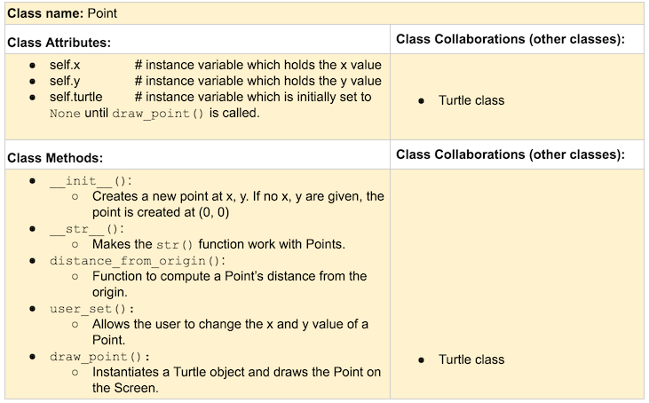

# Better Turtle Art

️**Author(s)**: Sara Adhikari, Logan Anglin

️**Google Doc Link**: https://docs.google.com/document/d/1U62Vq4dLpRE4KnS8BvkgvCrEdnPvM9KL7kCbR3C0ROc/edit?usp=sharing

---

**References**: 
T06: Turtle Art
Runestone Academy Chapter 15
---

## Milestone 1: Setup, Planning, Design

**Title**: Better Turtle Art

**Purpose**: Makes turtle art using GUI elements and classes.

**Sources**: T06: Turtle Art

**CRC Card(s)**:
https://docs.google.com/document/d/1QcI2DNarkomd1nqopJzh2mydYBW6Ot__GLUosWNVO5M/edit?usp=sharing

**GitHub Repo**:
https://github.com/Berea-College-CSC-226/p01-final-project-sara-logan.git

 
    
    

**Branches**: This project will require effective use of git. 
Each partner should create a branch at the beginning of the project, and stay on this branch (or branches of this branch) as they work.
When you need to bring each others branches together, do so by merging each other's branches into your own. 
1. Branch 1 name: LogansBranch
2. Branch 2 name: sara

---

## Milestone 2: Code

No README action items. Keep your issue queue up to date, and focus on your code. 🙃

Your repository should have, at a minimum, two branches; one for each partner, each with their contributions. 

Done!---

## Milestone 3: Virtual Check-In

Indicate what percentage of the project you have left to complete and how confident you feel. 

**Completion Percentage**: 20%

️**Confidence**: We are confident about what we have done so far but we are stuck in unittest. we were not sure how to create unittest for the turtle and GUI part of it but now we kind of have idea on that. 

️Keep your issue queue up to date, and continue to refine your code!

---

## Milestone 4: Final Code, Presentation, Demo

### User Instructions
In a paragraph, explain how to use your program. Assume the user is starting just after they hit the "Run" button in PyCharm. 
In a paragraph, explain how to use your program. Assume the user is starting just after they hit the "Run" button in PyCharm.
The program you provided is a simple turtle graphics application built using the tkinter and turtle modules in Python. 
When the user runs the program, a graphical user interface (GUI) window titled "Turtle Art" will appear. 
The GUI allows the user to interactively control a turtle that draws shapes on the screen. 
The user can choose the number of sides for the shapes, adjust the side length, increase or decrease the sides and size, randomize the shape and size, pause/unpause the drawing, and quit the program. 
The GUI provides buttons for these actions, but the user can also use keyboard shortcuts specified in the code (e.g., pressing "A" to increase sides, "D" to decrease sides). 
The turtle draws shapes based on the user's inputs or randomizes them if the corresponding button is clicked. 
Additionally, the user can click on the turtle window to specify a location for the next shape to be drawn. 
The program continuously draws shapes until the user pauses or quits the application. 
The code is designed to be user-friendly and interactive, offering both button controls and keyboard shortcuts for convenience.

### Errors and Constraints
Every program has bugs or features that had to be scrapped for time. 
These bugs should be tracked in the issue queue. You should already have a few items in here from the prior weeks. 
Create a new issue for any undocumented errors and deficiencies that remain in your code. 
Bugs found that aren't acknowledged in the queue will be penalized.

Issues that occurred:
1) The set minimum size was causing the GUI to become unresponsive on all screen sizes.
2) The infinite loop in the draw_shape_from_input method was leading the program becoming unresponsive before we consider implementing a way to stop or exit the drawing loop.
3) We were encountering problem in displaying full screen when the code is running.

Issues that might occur:
1) If the user hits the draw shape button after the program has been started, it may create a new turtle object. The program still works but it may look a little goofy.
2) We were unable to test the program on resolutions larger than 1920x1080 as we did not have access to higher resolution screens.
3) There could be issues running this code on different operating systems.

### Reflection
In three to four well-written paragraphs, address the following (at a minimum):
- Why did you select the project that you did?
-> When working on T06, I really enjoyed creating a program that drew shapes according to the user's input. It reminded me of the screensavers that 
use to be quite common of a sight, and my only complaint when making it at the time was the lack of control I and my partner had given to the user;
they were forced to use the terminal, had limited control over the shape, and had no way of controlling the program while it was executing. It was 
also easy to envision how we could create classes and GUI/keyboard controls to manipulate the program as it is executing.

- How closely did your final project reflect your initial design?
-> It is quite similar when comparing how the turtle window might look after several minutes of running. The only real difference in that aspect is
the turtle window now takes up the entire screen instead of the smaller default window size. What has changed radically is how the program is
controlled, both before the turtle window is created and while the turtle window is running. The user could only control how many sides each shape
has in the original code, and that was only before the turtle window was created with the terminal. The GUI, keybinds, and on_click abilities give the user much more
control. The final project is also many, many more lines of code.

- What did you learn from this process?
-> Code implementations rarely work on the first try. Much of the code took many iterations for it to work in a way we would prefer, and many functions
didn't work the way we would have expected them to. We also had to make a point of communicating ideas and what work we had done well. This was done
commit notes, comments in the code, docstrings, and text messages. We also learned the importance of having someone who didn't work on the program test it. 
I had a friend of mine run the program, and they almost immediately came across a bug we hadn't found. This is likely why quality assurance is often done by
a separate team rather than the people who wrote the code.

- What was the hardest part of the final project?
-> The most challenging aspect of the final project was managing the interaction between the turtle graphics and the tkinter GUI. 
Integrating user input from both mouse clicks and keyboard events while ensuring a smooth and responsive user experience
required careful coordination. Handling the continuous drawing of shapes in the turtle window, 
responding to user commands through buttons and keypresses, 
and updating the GUI to reflect the current state of the program posed a complex set of challenges. 

- What would you do differently next time, knowing what you know now?
-> Knowing what we know now, we would focus on improving code organization and modularity of the code. 
Breaking down the code into smaller, more manageable function with clear responsibilities would enhance readability and maintainability. 
We would also look into organize the GUI and turtle graphics interaction more effectively. 
utilizing a more modular code structure would not only make the implementation more straightforward but also facilitate easier maintenance and future extensions. 